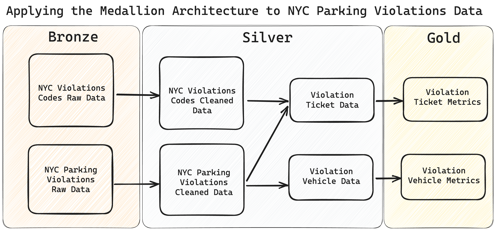
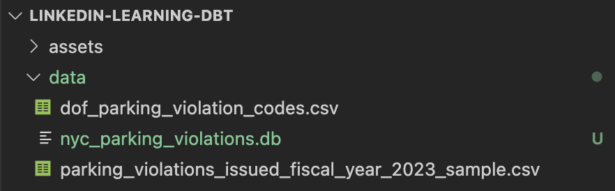
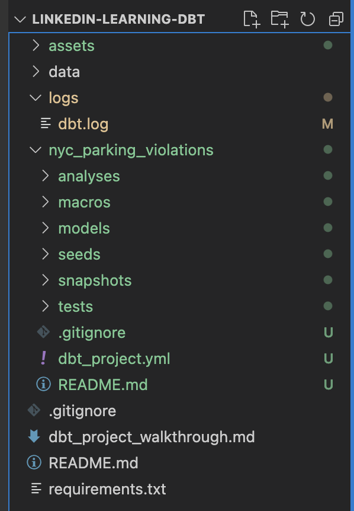
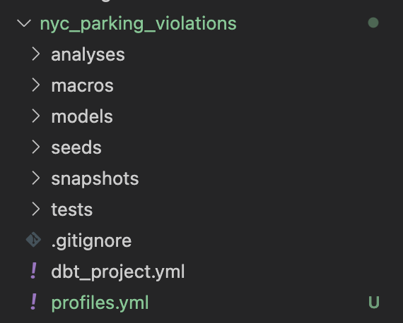
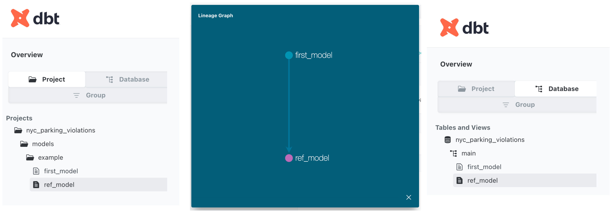
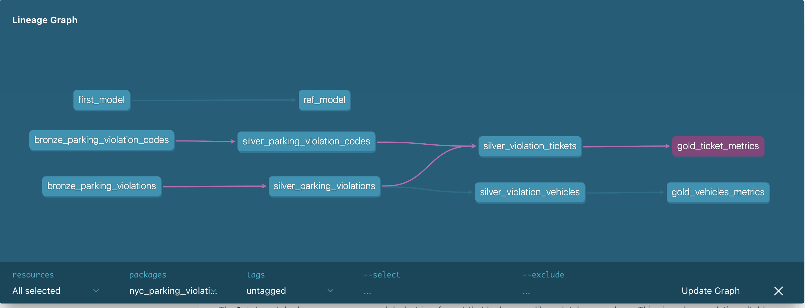
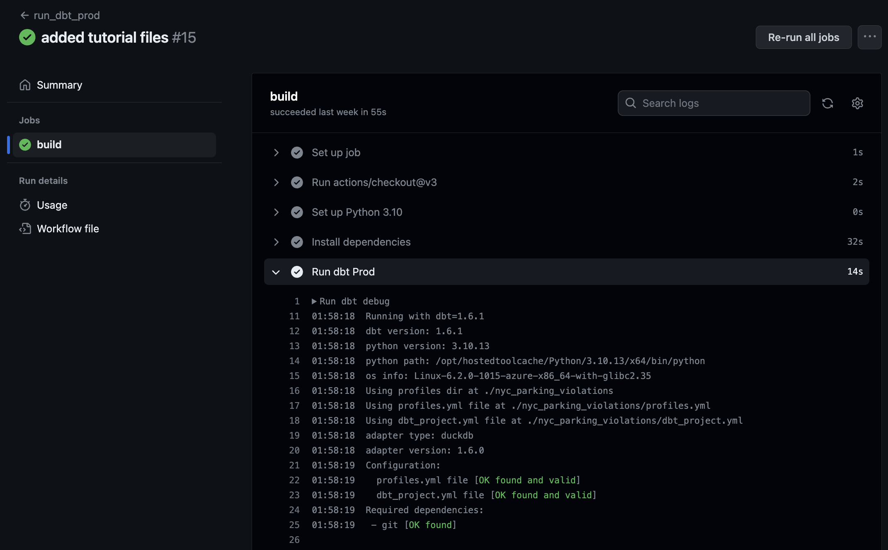

# LinkedIn Learning - dbt Core

## Using dbt Core to apply the Medallion Architecture to NYC parking violations data

### Scenario:

In this project you are a data engineer that's been tasked with transforming raw NYC parking violations data into the Medallion Architecture for your company's data lakehouse. Your team has decided to use dbt Core to implement this project as it allows you to use software engineering best practices for your SQL transformations.

By the end of this project, you should have a data pipeline and assets that roughly match the below diagram:



### Data:

This project utilizes two public government datasets sourced from NYC Open Data:

**1. [NYC Parking Violations Issued - Fiscal Year 2023](https://data.cityofnewyork.us/City-Government/Parking-Violations-Issued-Fiscal-Year-2023/pvqr-7yc4)**  
> Parking Violations Issuance datasets contain violations issued during the respective fiscal year. The Issuance datasets are not updated to reflect violation status, the information only represents the violation(s) at the time they are issued. Since appearing on an issuance dataset, a violation may have been paid, dismissed via a hearing, statutorily expired, or had other changes to its status. To see the current status of outstanding parking violations, please look at the Open Parking & Camera Violations dataset.

Note that this dataset is rather large for this project, so we will use a sample of 100K records.

**2. [NYC Department of Finance Parking Violation Codes](https://data.cityofnewyork.us/Transportation/DOF-Parking-Violation-Codes/ncbg-6agr)**  
> This dataset defines the parking violation codes in New York City and lists the fines. Each fine amount includes a $15 New York State Criminal Justice surcharge.

# Project

## Step 1: Download dbt Core

### Install the dbt Core via pip:

The package `dbt-core` is the main package that all connectors and additional plugins build off of in the dbt ecosystem. You will want to download this first.


```bash
❯ pip install dbt-core==1.6.1
```

Documentation: https://docs.getdbt.com/docs/core/pip-install

```bash
❯ pip show dbt-core

Name: dbt-core
Version: 1.6.1
Summary: With dbt, data analysts and engineers can build analytics the way engineers build applications.
Home-page: https://github.com/dbt-labs/dbt-core
Author: dbt Labs
Author-email: info@dbtlabs.com
```

```bash
❯ pip install dbt-duckdb==1.6.0
```

### Install the dbt connector to DuckDB:

DuckDB is a lightweight analytical database that's great for local and or small data, such as this tutorial.

Documentation: https://docs.getdbt.com/docs/core/connect-data-platform/duckdb-setup

```bash
❯ pip show dbt-duckdb

Name: dbt-duckdb
Version: 1.6.0
Summary: The duckdb adapter plugin for dbt (data build tool)
Home-page: https://github.com/jwills/dbt-duckdb
Author: Josh Wills
Author-email: joshwills+dbt@gmail.com
```

### Create a requirements.txt file for your project:

Create a `requirements.txt` file within your repo and add the following:
```bash
dbt-core==1.6.1
dbt-duckdb==1.6.0
```

## Step 2: Download duckDB

We are using DuckDB for this project because it's simple to use, and can be easily used within your local environment. Thus, there is no need to setup an external cloud account such as GCP BigQuery.

Documentation: https://duckdb.org/docs/installation

### Install DuckDB via pip:

```bash
❯ pip install duckdb==0.9.0
```

```bash
❯ pip show duckdb
Name: duckdb
Version: 0.8.1
Summary: DuckDB embedded database
Home-page: https://www.duckdb.org
```

### Update your requirements.txt file within your project:

Update your `requirements.txt` file within your repo to look like the following:
```bash
dbt-core==1.6.1
dbt-duckdb==1.6.0
duckdb==0.9.0
```

## Step 3: Prepare Your Database Environment

In most cases, you will likely be connecting dbt Core to an existing database. For this tutorial, we are leveraging DuckDB so that everything can be done locally and within a Jupyter notebook. Thus, we need to setup our DuckDB database in a few commands.

### Create your database file:

Since the database doesn't exist yet, DuckDB will autogenerate the file `nyc_parking_violations.db` whenver you run a SQL command. Run the following code within the notebook `run_sql_queries_here.ipynb`:

```python
sql_query = '''
show tables
'''

with duckdb.connect('data/nyc_parking_violations.db') as con:
    display(con.sql(sql_query).df())
```

You should now see the database file within your data folder.



### Import CSV data into your new database:

Once the database is activated, you can insert the CSV data with the following SQL commands within the DuckDB Python interface in the notebook:

```python
sql_query_import_1 = '''
CREATE OR REPLACE TABLE parking_violation_codes AS
SELECT *
FROM read_csv_auto(
  'data/dof_parking_violation_codes.csv',
  normalize_names=True
  )
'''

sql_query_import_2 = '''
CREATE OR REPLACE TABLE parking_violations_2023 AS
SELECT *
FROM read_csv_auto(
  'data/parking_violations_issued_fiscal_year_2023_sample.csv',
  normalize_names=True
  )
'''

with duckdb.connect('data/nyc_parking_violations.db') as con:
  con.sql(sql_query_import_1)
  con.sql(sql_query_import_2)
```
Now let's run `show tables` again within the SQL cell, and we should see our new tables within DuckDB.

```python
sql_query = '''
show tables
'''

with duckdb.connect('data/nyc_parking_violations.db') as con:
    display(con.sql(sql_query).df())

# output
# ┌─────────────────────────┐
# │          name           │
# │         varchar         │
# ├─────────────────────────┤
# │ parking_violation_codes │
# │ parking_violations_2023 │
# └─────────────────────────┘
```

We can also query our data with the SQL cell via the following:
```python
sql_query = '''
SELECT * FROM parking_violation_codes LIMIT 5
'''

with duckdb.connect('data/nyc_parking_violations.db') as con:
    display(con.sql(sql_query).df())

# output
# ┌───────┬────────────────────────────────┬─────────────────────────┬─────────────────┐
# │ code  │           definition           │ manhattan_96th_st_below │ all_other_areas │
# │ int64 │            varchar             │          int64          │      int64      │
# ├───────┼────────────────────────────────┼─────────────────────────┼─────────────────┤
# │     1 │ FAILURE TO DISPLAY BUS PERMIT  │                     515 │             515 │
# │     2 │ NO OPERATOR NAM/ADD/PH DISPLAY │                     515 │             515 │
# │     3 │ UNAUTHORIZED PASSENGER PICK-UP │                     515 │             515 │
# │     4 │ BUS PARKING IN LOWER MANHATTAN │                     115 │             115 │
# │     5 │ BUS LANE VIOLATION             │                     250 │             250 │
# └───────┴────────────────────────────────┴─────────────────────────┴─────────────────┘
```

## Step 4: Create a dbt Project

Creating a new project with dbt is simple as it has a builtin command, `dbt init` that will autogenerate a new dbt project with every file you need to get started, as well have the dbt directory properly organized.

```bash
❯ dbt init

Running with dbt=1.6.1
Creating dbt configuration folder at 
Enter a name for your project (letters, digits, underscore):
```

After running `dbt init`, dbt will ask you to name the project. In the CLI enter the name `nyc_parking_violations` for the project.

```bash
❯ Enter a name for your project (letters, digits, underscore): nyc_parking_violations

Your new dbt project "nyc_parking_violations" was created!
```

You should now see the `logs` and `nyc_parking_violations` folders and subsequent files all autogenerated after successfully running `dbt_init`.  


## Step 5: Prepare Your dbt Environment

Before we are able to use dbt Core, we first need to setup our configurations and connect dbt to our database (DuckDB for this tutorial).

### The project YAML file:

One of the autogenerated files within your project called `nyc_parking_violations` is a YAML file called `dbt_project.yml`. This is the configuration file that controls all the setting's for your dbt project, and informs dbt Core where to look and take actions.

Documentation: https://docs.getdbt.com/docs/build/projects#project-configuration

At this point, the default settings will suffice, but lets breakdown the key components of the `dbt_project.yml` file so you know how to navigate it:

In an earlier step, the dbt CLI asked us to name our project. This name is passed onto the rest of the project's directories and configuration files, and dbt uses this name to know which project to reference. It doesn't make a huge difference for this tutorial, but within a production dbt project it's possible to have multiple profiles that you need to manage.
```yaml
profile: 'nyc_parking_violations'
```

In addition, dbt needs to also know where in the directory to look for specific files such as your SQL models or tests. Note that there are numerous paths dbt references, but for this intro tutorial we will only focus on `model-paths`, and `test-paths`.
```yaml
model-paths: ["models"]
analysis-paths: ["analyses"]
test-paths: ["tests"]
seed-paths: ["seeds"]
macro-paths: ["macros"]
snapshot-paths: ["snapshots"]
```

With dbt Core, every time you run the dbt project it will create "assets" that are essentially logs of the action dbt conducted. There may be instances where you want such assets removed and this informs dbt Core where such cleaning happens.
```yaml
clean-targets:
  - "target"
  - "dbt_packages"
```

Finally, the `models` configurations is where we will spend most of our time within the tutorial as it informs the dbt project how the output of the SQL models should be treated. By default, the autogenerated has the output data materialized as a view but this can be changed to tables, incremental builds, or even ephemeral (analogous to a temp table).
```yaml
models:
  nyc_parking_violations:
    example:
      +materialized: view
```

### The profiles YAML file:

When we ran `dbt init`, something peculiar happened:
```bash
Setting up your profile.
Which database would you like to use?
[1] duckdb

Enter a number: 1
No sample profile found for duckdb.
```

Because DuckDB is a relatively new open-source database, it doesn't have a sample profile setup within the `dbt init` workflow (maybe an awesome open-source project for an adventurous learner!), as noted with "No sample profile found for duckdb." This is a great learning opportunity for us though, as it requires us to setup our own `profiles.yml` file. Being able to create and configure this file will set you up for success, as this is a key difference between dbt Core and dbt Cloud that automatically manages this.

Thankfully, we don't need to create this file from scratch, as the `dbt-duckdb` integration we downloaded has great documentation and a template that we will implement in the next section.

Documentation: https://github.com/jwills/dbt-duckdb#configuring-your-profile

### Creating your profiles YAML file:

1. Within your `nyc_parking_violations` dbt project, create a new file called `profiles.yml`.

```bash
❯ cd nyc_parking_violations
❯ touch profiles.yml
```

You should now see the `profiles.yml` file in your `nyc_parking_violations` directory.



2. Add the following lines to your new `profiles.yml` based on `dbt-duckdb` instructions.

```yaml
default:
  outputs:
   dev:
     type: duckdb
  target: dev
```

Please note that this is a `dev` profile, and we will need to update this at a later time in the tutorial to also allow a production workflow.

### Connecting your profiles and project YAML files:

From the dbt documentation on how the `dbt_project.yml` and  `profiles.yml` files interact:

> *"When you run dbt from the CLI, it reads your dbt_project.yml file to find the profile name, and then looks for a profile with the same name in your profiles.yml file. This profile contains all the information dbt needs to connect to your data platform."*

You can check if the `dbt_project.yml` and  `profiles.yml` files are connected by running the following CLI command `dbt debug`. If you run this with our current configurations, you should get an error that's easy to fix:

```bash
❯ dbt debug
Running with dbt=1.6.1
dbt version: 1.6.1
python version: 3.9.15
.
.
.
Configuration:
  profiles.yml file [ERROR invalid]
  dbt_project.yml file [OK found and valid]
Required dependencies:
 - git [OK found]

Connection test skipped since no profile was found
1 check failed:
Profile loading failed for the following reason:
Runtime Error
  Could not find profile named 'nyc_parking_violations'
```

This is an easy fix, as we just need to ensure the line `profile: 'nyc_parking_violations'` within `dbt_project.yml` matches the header line within `profiles.yml`. To do this, we update `profiles.yml` from `default:` to `nyc_parking_violations:` and add the path to the DuckDB database. Thus your final `profiles.yml` should look like this:

```yaml
nyc_parking_violations:
  outputs:
   dev:
     type: duckdb
     path: '../data/nyc_parking_violations.db'
  target: dev
```

After saving, running `dbt debug` in the CLI should pass all checks!

```bash
❯ dbt debug
Running with dbt=1.6.1
dbt version: 1.6.1
python version: 3.9.15
.
.
.
adapter type: duckdb
adapter version: 1.6.0
Configuration:
  profiles.yml file [OK found and valid]
  dbt_project.yml file [OK found and valid]
Required dependencies:
 - git [OK found]

Connection:
  database: nyc_parking_violations
  schema: main
  path: ../data/nyc_parking_violations.db
.
.
.
All checks passed!
```

We are now ready to start building our dbt models!

## Step 6: Your First dbt Model

When we ran `dbt init` it created two example dbt models within the directory `nyc_parking_violations/models/example`. We can delete these files as we are going to create our own models.

### Create your first dbt model file:

dbt models are just `.sql` files with a few extra tools you can use with them (we will explain more in Step 8). Let's create our first dbt model using the `touch` command within our terminal.
```bash
touch models/example/first_model.sql
```

We will create a simple first dbt model with the following SQL:
```sql
SELECT * FROM parking_violation_codes
```
In the next step, we will go over the common dbt CLI commands to run our dbt models.

## Step 7: Using dbt CLI Commands

There are three main dbt CLI commands to get you started:  
1. `dbt debug`: Checks to see if your configuration files are setup correctly and recognized by dbt Core.
2. `dbt compile`: Runs all the dbt models end-to-end, but doesn't execute the models' SQL code nor materialize the tables; which is useful for quickly checking if your dbt models have any errors.
3. `dbt run`: Runs all the dbt models end-to-end, executes the SQL code, and materialize the tables based on the profile configurations.

*Note: A common mistake is not running your dbt commands within your dbt project directory. This will result in an error.*

### `dbt debug`:

One of my first steps when I'm developing a dbt project is running `dbt debug` as it helps me catch simple errors.
```bash
❯ dbt debug
Running with dbt=1.6.1
dbt version: 1.6.1
python version: 3.9.15
.
.
.
adapter type: duckdb
adapter version: 1.6.0
Configuration:
  profiles.yml file [OK found and valid]
  dbt_project.yml file [OK found and valid]
Required dependencies:
 - git [OK found]

Connection:
  database: nyc_parking_violations
  schema: main
  path: ../data/nyc_parking_violations.db
  config_options: None
  extensions: None
  settings: None
  external_root: .
  use_credential_provider: None
  attach: None
  filesystems: None
  remote: None
  plugins: None
  disable_transactions: False
Registered adapter: duckdb=1.6.0
  Connection test: [OK connection ok]

All checks passed!
```

### `dbt compile`:

While this command is optional, I typically like to use this command before `dbt run` as it will catch errors to my dbt models early. This isn't much of a benefit for this small dbt project, but for dbt projects processing quite a large amount of data, this check can save you quite a bit of time by avoiding a late breaking error.

```bash
❯ dbt compile
Running with dbt=1.6.1
Registered adapter: duckdb=1.6.0
Found 1 model, 0 sources, 0 exposures, 0 metrics, 348 macros, 0 groups, 0 semantic models

Concurrency: 1 threads (target='dev')
```

### `dbt run`:

This is the most important dbt Core CLI command, as it's what run's your entire dbt project and conducts the data transformations within your database.

```bash
❯ dbt run
Running with dbt=1.6.1
Registered adapter: duckdb=1.6.0
Found 1 model, 0 sources, 0 exposures, 0 metrics, 348 macros, 0 groups, 0 semantic models

Concurrency: 1 threads (target='dev')

1 of 1 START sql view model main.first_model ................................... [RUN]
1 of 1 OK created sql view model main.first_model .............................. [OK in 0.05s]

Finished running 1 view model in 0 hours 0 minutes and 0.12 seconds (0.12s).

Completed successfully

Done. PASS=1 WARN=0 ERROR=0 SKIP=0 TOTAL=1
```

You can check the results of `dbt run` as there will be a new table within our DuckDB database. Go to the Jupyter notebook `run_sql_queries_here.ipynb` and run `show tables` to see for yourself.

```python
sql_query = '''
show tables
'''

with duckdb.connect('data/nyc_parking_violations.db') as con:
    display(con.sql(sql_query).df())

# output
# ┌─────────────────────────┐
# │          name           │
# │         varchar         │
# ├─────────────────────────┤
# │ first_model             │
# │ parking_violation_codes │
# │ parking_violations_2023 │
# └─────────────────────────┘
```

Note how the table name within our DuckDB database matches the filename of our dbt model. This behavior of dbt is essential for organizing your dbt project, as each dbt model name needs to be unique.

## Step 8: Introduction to dbt Ref Function

As mentioned earlier, dbt enables some useful tools for your `.sql` files. Specifically, dbt enables you to use "jinja syntax" to add more functionality to SQL. The most important syntax within dbt are `ref` statements or `{{ref('your_dbt_model_name')}}`. This syntax is powerful, as it allows dbt to create lineage for yor data transformations-- essential for orchestration, creating dependencies, and documentation.

### Create your dbt model utilizing `ref`:

Let's create our second dbt model using the `touch` command within our terminal and name it `ref_model.sql`.

```bash
touch models/example/ref_model.sql
```

We will create a second dbt model with the following SQL and `ref` command:
```sql
SELECT
    COUNT(*)
FROM
    {{ref('first_model')}}
```

### Run your dbt models with the `ref` syntax:

With our second model in place, and utilizing the `ref` syntax, we can see the power of dbt for data transformations.

```bash
❯ dbt run
Running with dbt=1.6.1
Registered adapter: duckdb=1.6.0
Found 2 models, 0 sources, 0 exposures, 0 metrics, 348 macros, 0 groups, 0 semantic models

Concurrency: 1 threads (target='dev')

1 of 2 START sql view model main.first_model ................................... [RUN]
1 of 2 OK created sql view model main.first_model .............................. [OK in 0.05s]
2 of 2 START sql view model main.ref_model ..................................... [RUN]
2 of 2 OK created sql view model main.ref_model ................................ [OK in 0.02s]

Finished running 2 view models in 0 hours 0 minutes and 0.14 seconds (0.14s).

Completed successfully

Done. PASS=2 WARN=0 ERROR=0 SKIP=0 TOTAL=2
```

Notice how dbt knew to run `first_model.sql` first and `ref_model.sql` second.

In addition, we can check our DuckDB database and see the output of the SQL from the `ref_model.sql` model via the following SQL query within `run_sql_queries_here.ipynb`.

```python
sql_query = '''
SELECT * FROM ref_model
'''

with duckdb.connect('data/nyc_parking_violations.db') as con:
    display(con.sql(sql_query).df())

# output
# ┌──────────────┐
# │ count_star() │
# │    int64     │
# ├──────────────┤
# │           97 │
# └──────────────┘
```

### View your dbt project data lineage:

We will go over dbt docs in much more detail in Step 10, but this quick intro will allow you to visualize our dbt project.

Creating dbt docs is as simple as running the CLI command `dbt docs generate`, which will autogenerate a docs files for the local host within the `nyc_parking_violations/target` folder.

```bash
❯ dbt docs generate
Running with dbt=1.6.1
Registered adapter: duckdb=1.6.0
Found 2 models, 0 sources, 0 exposures, 0 metrics, 348 macros, 0 groups, 0 semantic models

Concurrency: 1 threads (target='dev')

Building catalog
Catalog written to nyc_parking_violations/target/catalog.json
```

Then to view the dbt docs, you run the CLI command `dbt docs serve` which will launch a local host website of the dbt docs.

```bash
❯ dbt docs serve
05:42:00  Running with dbt=1.6.1
Serving docs at 8080
To access from your browser, navigate to: http://localhost:8080
```

The docs and lineage for our starter dbt project looks like the following:


## Step 9: Implementing Medallion Architecture Planning

Now that we know how to use dbt Core, we can implement the data request:

> In this project you are a data engineer that's been tasked with transforming raw NYC parking violations data into the Medallion Architecture for your company's data lakehouse. Your team has decided to use dbt Core to implement this project as it allows you to use software engineering best practices for your SQL transformations.

Our ultimate goals of this project is to have a data pipeline and assets that roughly match the below diagram: 

### Project breakdown:

We can break up this larger project into the following components:
- **Bronze Data**
  - Goal: Raw data with minimal cleaning and transformations.
  - Tables:
    - bronze_parking_violation_codes
    - bronze_parking_violations
- **Silver Data**
  - Goal: Cleaned data with applied business logic, and ultimately in an established data model.
  - Tables:
    - silver_parking_violation_codes
    - silver_parking_violations
    - silver_violation_tickets
    - silver_violation_vehicles
- **Gold Data**
  - Goal: Metrics built on top of silver data that are often served to the business via dashboards.
  - Tables:
    - gold_ticket_location_metrics
    - gold_vehicles_metrics

## Step 10: Medallion Architecture - Bronze Data:

Bronze data should be in a *mostly* raw state, where minor transformations are made to make it easier to manage data within the analytical database. For our use case, we are going to take a subset of the parking violations data columns.

We should have the following tables added to our database when we are done:  
**Bronze Data**
- bronze_parking_violation_codes
- bronze_parking_violations

Create a directory within the `nyc_parking_violations/models` folder called `bronze` and create two files called `bronze_parking_violation_codes.sql` and 
`bronze_parking_violations.sql`.

```bash
❯ mkdir models/bronze
❯ touch models/bronze/bronze_parking_violation_codes.sql
❯ touch models/bronze/bronze_parking_violations.sql
```

### Create `bronze_parking_violation_codes.sql` table:

Now we will add our SQL code to `bronze_parking_violation_codes.sql`. Since it's a small table, we will bring in all of the columns. The one small change we will make is changing the column name of `code` to `violation_code` so that it aligns with the parking violations dataset.

```sql
SELECT
    code AS violation_code,
    definition,
    manhattan_96th_st_below,
    all_other_areas
FROM
    parking_violation_codes
```

### Create `bronze_parking_violations.sql` table:

Next lets add our SQL code to `bronze_parking_violations.sql`. Note that there are many columns in this table, but we only need a subset for our use case.

```sql
SELECT
    summons_number,
    registration_state,
    plate_type,
    issue_date,
    violation_code,
    vehicle_body_type,
    vehicle_make,
    issuing_agency,
    vehicle_expiration_date,
    violation_location,
    violation_precinct,
    issuer_precinct,
    issuer_code,
    issuer_command,
    issuer_squad,
    violation_time,
    violation_county,
    violation_legal_code,
    vehicle_color,
    vehicle_year,
FROM
    parking_violations_2023
```

### Build bronze tables via dbt:

With all of our bronze dbt models prepared, we can now run the dbt commands from Step 7 to update our DuckDB database.

```bash
❯ dbt debug
❯ dbt compile
❯ dbt run

Running with dbt=1.6.1
Registered adapter: duckdb=1.6.0
Found 4 models, 0 sources, 0 exposures, 0 metrics, 348 macros, 0 groups, 0 semantic models

Concurrency: 1 threads (target='dev')

1 of 4 START sql view model main.bronze_parking_violation_codes ................ [RUN]
1 of 4 OK created sql view model main.bronze_parking_violation_codes ........... [OK in 0.06s]
2 of 4 START sql view model main.bronze_parking_violations ..................... [RUN]
2 of 4 OK created sql view model main.bronze_parking_violations ................ [OK in 0.02s]
3 of 4 START sql view model main.first_model ................................... [RUN]
3 of 4 OK created sql view model main.first_model .............................. [OK in 0.02s]
4 of 4 START sql view model main.ref_model ..................................... [RUN]
4 of 4 OK created sql view model main.ref_model ................................ [OK in 0.02s]

Finished running 4 view models in 0 hours 0 minutes and 0.19 seconds (0.19s).

Completed successfully

Done. PASS=4 WARN=0 ERROR=0 SKIP=0 TOTAL=4
```

### View bronze tables in database:

We can also confirm that the changes are represented in our database.

```python
sql_query = '''
show tables
'''

with duckdb.connect('data/nyc_parking_violations.db') as con:
    display(con.sql(sql_query).df())

# output
# ┌────────────────────────────────┐
# │              name              │
# │            varchar             │
# ├────────────────────────────────┤
# │ bronze_parking_violation_codes │
# │ bronze_parking_violations      │
# │ first_model                    │
# │ parking_violation_codes        │
# │ parking_violations_2023        │
# │ ref_model                      │
# └────────────────────────────────┘
```
```python
sql_query = '''
SELECT * FROM bronze_parking_violations LIMIT 3
'''

with duckdb.connect('data/nyc_parking_violations.db') as con:
    display(con.sql(sql_query).df())

# output
# ┌────────────────┬──────────┬───┬─────────────────────┬──────────────────────┐
# │ summons_number │ plate_id │ … │ violation_post_code │ violation_descript…  │
# │     int64      │ varchar  │   │       varchar       │       varchar        │
# ├────────────────┼──────────┼───┼─────────────────────┼──────────────────────┤
# │     9010912681 │ MN686640 │ … │ 08                  │ 17-No Stand (exc a…  │
# │     4858762841 │ LBG4461  │ … │                     │ PHTO SCHOOL ZN SPE…  │
# │     4854645684 │ 0982AY   │ … │                     │ PHTO SCHOOL ZN SPE…  │
# ├────────────────┴──────────┴───┴─────────────────────┴──────────────────────┤
# │ 3 rows                                                27 columns (4 shown) │
# └────────────────────────────────────────────────────────────────────────────┘
```

## Step 11: Medallion Architecture - Silver Data

Silver data should align with your established data model for your analytical database. While data modeling is extremely important in data engineering, that is not the goal of this tutorial. Instead, we are going to focus on the following outcomes for the silver data:  
1. Expand the parking violation code table, `parking_violation_codes`, so that each row is unique and is either a `manhattan_96th_st_below` or a `all_other_areas` fee.
2. Classify each row in `parking_violations` as either occurring in `manhattan_96th_st_below` or `all_other_areas`.
3. Creating a new table by merging the cleaned `parking_violation_codes` and `parking_violations` tables and extracting only the violations data to determine the actual fee for each violation.
4. Creating a new table by extracting the vehicle data from the cleaned `parking_violations` table.

We should have the following tables added to our database when we are done:  
**Silver Data**
- silver_parking_violation_codes
- silver_parking_violations
- silver_violation_tickets
- silver_violation_vehicles

Create a directory within the `nyc_parking_violations/models` folder called `silver` and create four files called `silver_parking_violation_codes.sql`, 
`silver_parking_violations.sql`, `silver_violation_tickets.sql`, and `silver_violation_vehicles.sql`.

```bash
❯ mkdir models/silver
❯ touch models/silver/silver_parking_violation_codes.sql
❯ touch models/silver/silver_parking_violations.sql
❯ touch models/silver/silver_violation_tickets.sql
❯ touch models/silver/silver_violation_vehicles.sql
```

### Create `silver_parking_violation_codes.sql` table:

Now we will add our SQL code to `silver_parking_violation_codes.sql`. The source table, `bronze_parking_violation_codes`, has fee values in two separate columns, `manhattan_96th_st_below` and `all_other_areas`, and we need to have it under one single column. This will enable us to easily merge this table in a later step.

```sql
WITH manhattan_violation_codes AS (
    SELECT
        violation_code,
        definition,
        TRUE AS is_manhattan_96th_st_below,
        manhattan_96th_st_below AS fee_usd,
    FROM
        {{ref('bronze_parking_violation_codes')}}
),

all_other_violation_codes AS (
    SELECT
        violation_code,
        definition,
        FALSE AS is_manhattan_96th_st_below,
        all_other_areas AS fee_usd,
    FROM
        {{ref('bronze_parking_violation_codes')}}
)

SELECT * FROM manhattan_violation_codes
UNION ALL
SELECT * FROM all_other_violation_codes
ORDER BY violation_code ASC
```

Note how we only used `{{ref()}}` statement when referring to tables in the database, but not for tables created during the query such as `manhattan_violation_codes`.

### Create `silver_parking_violations.sql` table:

Next we will add our SQL code to `silver_parking_violations.sql`. For this step we need to classify whether an issued ticket was issued below Manhattan 96th street. To keep things very simple, and have the focus on learning dbt, we are just going to assume if `violation_county` equals `MN` then consider `is_manhattan_96th_st_below` as `TRUE`.

I want to heavily caveat that resolving these business logic nuances is a core part of data engineering work, and outside of this tutorial, one would spend substantial time making sure the data semantics matched the business use case.

```sql
SELECT
    summons_number,
    registration_state,
    plate_type,
    issue_date,
    violation_code,
    vehicle_body_type,
    vehicle_make,
    issuing_agency,
    vehicle_expiration_date,
    violation_location,
    violation_precinct,
    issuer_precinct,
    issuer_code,
    issuer_command,
    issuer_squad,
    violation_time,
    violation_county,
    violation_legal_code,
    vehicle_color,
    vehicle_year,
    CASE WHEN
        violation_county == 'MN'
        THEN TRUE
        ELSE FALSE
        END AS is_manhattan_96th_st_below
FROM
    {{ref('bronze_parking_violations')}}
```

### Create `silver_violation_tickets.sql` table:

Next we will add our SQL code to `silver_violation_tickets.sql`. This step requires us to merge the two silver tables we previously created. Thus, we will need to utilize the `{{ref()}}` statement again. For this table we want to remove any columns related to vehicle information, and we want to determine the `fee_usd` value for each violation. To do this we will merge the table`silver_parking_violations` and `silver_parking_violation_codes` on the values `violation_code` and `is_manhattan_96th_st_below`.

```sql
SELECT
    violations.summons_number,
    violations.issue_date,
    violations.violation_code,
    violations.is_manhattan_96th_st_below,
    violations.issuing_agency,
    violations.violation_location,
    violations.violation_precinct,
    violations.issuer_precinct,
    violations.issuer_code,
    violations.issuer_command,
    violations.issuer_squad,
    violations.violation_time,
    violations.violation_county,
    violations.violation_legal_code,
    codes.fee_usd
FROM
    {{ref('silver_parking_violations')}} AS violations
LEFT JOIN
    {{ref('silver_parking_violation_codes')}} AS codes ON
    violations.violation_code = codes.violation_code AND
    violations.is_manhattan_96th_st_below = codes.is_manhattan_96th_st_below
```

### Create `silver_violation_vehicles.sql` table:

Finally, we will add our SQL code to the last silver table, `silver_violation_vehicles`. For this table we only want the column values related to vehicle information and our primary key `summons_number`.

```sql
SELECT
    summons_number,
    registration_state,
    plate_type,
    vehicle_body_type,
    vehicle_make,
    vehicle_expiration_date,
    vehicle_color,
    vehicle_year
FROM
    {{ref('silver_parking_violations')}}
```

### Build silver tables via dbt:

With all of our silver dbt models prepared, we can now run the dbt commands to update our DuckDB database.
```bash
❯ dbt debug
❯ dbt compile
❯ dbt run

Running with dbt=1.6.1
Registered adapter: duckdb=1.6.0
Found 8 models, 0 sources, 0 exposures, 0 metrics, 348 macros, 0 groups, 0 semantic models

Concurrency: 1 threads (target='dev')

1 of 8 START sql view model main.bronze_parking_violation_codes ................ [RUN]
1 of 8 OK created sql view model main.bronze_parking_violation_codes ........... [OK in 0.05s]
2 of 8 START sql view model main.bronze_parking_violations ..................... [RUN]
2 of 8 OK created sql view model main.bronze_parking_violations ................ [OK in 0.02s]
3 of 8 START sql view model main.first_model ................................... [RUN]
3 of 8 OK created sql view model main.first_model .............................. [OK in 0.02s]
4 of 8 START sql view model main.silver_parking_violation_codes ................ [RUN]
4 of 8 OK created sql view model main.silver_parking_violation_codes ........... [OK in 0.02s]
5 of 8 START sql view model main.silver_parking_violations ..................... [RUN]
5 of 8 OK created sql view model main.silver_parking_violations ................ [OK in 0.02s]
6 of 8 START sql view model main.ref_model ..................................... [RUN]
6 of 8 OK created sql view model main.ref_model ................................ [OK in 0.05s]
7 of 8 START sql view model main.silver_violation_tickets ...................... [RUN]
7 of 8 OK created sql view model main.silver_violation_tickets ................. [OK in 0.02s]
8 of 8 START sql view model main.silver_violation_vehicles ..................... [RUN]
8 of 8 OK created sql view model main.silver_violation_vehicles ................ [OK in 0.02s]

Finished running 8 view models in 0 hours 0 minutes and 0.34 seconds (0.34s).

Completed successfully

Done. PASS=8 WARN=0 ERROR=0 SKIP=0 TOTAL=8
```

### View silver tables in database:

We can also confirm that the changes are represented in our database.

```python
sql_query = '''
show tables
'''

with duckdb.connect('data/nyc_parking_violations.db') as con:
    display(con.sql(sql_query).df())

# output
# ┌────────────────────────────────┐
# │              name              │
# │            varchar             │
# ├────────────────────────────────┤
# │ bronze_parking_violation_codes │
# │ bronze_parking_violations      │
# │ first_model                    │
# │ parking_violation_codes        │
# │ parking_violations_2023        │
# │ ref_model                      │
# │ silver_parking_violation_codes │
# │ silver_parking_violations      │
# │ silver_violation_tickets       │
# │ silver_violation_vehicles      │
# └────────────────────────────────┘
```

```python
sql_query = '''
SELECT * FROM silver_violation_vehicles LIMIT 3
'''

with duckdb.connect('data/nyc_parking_violations.db') as con:
    display(con.sql(sql_query).df())

# output
# ┌────────────────┬────────────────────┬────────────┬───┬──────────────┐
# │ summons_number │ registration_state │ plate_type │ … │ vehicle_year │
# │     int64      │      varchar       │  varchar   │   │    int64     │
# ├────────────────┼────────────────────┼────────────┼───┼──────────────┤
# │     9010912681 │ CA                 │ PAS        │ … │            0 │
# │     4858762841 │ NY                 │ PAS        │ … │         2003 │
# │     4854645684 │ FL                 │ PAS        │ … │         2022 │
# ├────────────────┴────────────────────┴────────────┴───┴──────────────┤
# │ 3 rows                                          8 columns (4 shown) │
# └─────────────────────────────────────────────────────────────────────┘
```

## Step 12: Medallion Architecture - Gold Data

Gold data is ideally for metrics and aggregates that will be utilized by downstream data consumers via reports and dashboards.

We should have the following tables added to our database when we are done:  
**Gold Data**
- gold_ticket_location_metrics
- gold_vehicles_metrics

Create a directory within the `nyc_parking_violations/models` folder called `gold` and create two files called `gold_ticket_metrics.sql` and `gold_vehicles_metrics.sql`.

```bash
❯ mkdir models/gold
❯ touch models/gold/gold_ticket_metrics.sql
❯ touch models/gold/gold_vehicles_metrics.sql
```

### Create `gold_ticket_metrics.sql` table:

Now we will add our SQL code to `gold_ticket_metrics.sql`. For this table we want to understand how many tickets were issued and the total fee revenue the city made for each violation code.

```sql
SELECT
    violation_code,
    COUNT(summons_number) AS ticket_count,
    SUM(fee_usd) AS total_revenue_usd
FROM
    {{ref('silver_violation_tickets')}}
GROUP BY
    violation_code
ORDER BY
    total_revenue_usd DESC
```

### Create `gold_vehicles_metrics.sql` table:

We will create our final SQL code for this tutorial with `gold_vehicles_metrics.sql`. For this table we want to determine which specific vehicles get the most violation tickets.

```sql
SELECT
    registration_state,
    COUNT(summons_number) AS ticket_count,
FROM
    {{ref('silver_violation_vehicles')}}
WHERE
    registration_state != 'NY'
GROUP BY
    registration_state
ORDER BY
    ticket_count DESC
```
### Build gold tables via dbt:

With all of our gold dbt models prepared, we can now run the dbt commands to update our DuckDB database.

```bash
❯ dbt debug
❯ dbt compile
❯ dbt run

Running with dbt=1.6.1
Registered adapter: duckdb=1.6.0
Found 10 models, 0 sources, 0 exposures, 0 metrics, 348 macros, 0 groups, 0 semantic models

Concurrency: 1 threads (target='dev')

1 of 10 START sql view model main.bronze_parking_violation_codes ............... [RUN]
1 of 10 OK created sql view model main.bronze_parking_violation_codes .......... [OK in 0.06s]
2 of 10 START sql view model main.bronze_parking_violations .................... [RUN]
2 of 10 OK created sql view model main.bronze_parking_violations ............... [OK in 0.02s]
3 of 10 START sql view model main.first_model .................................. [RUN]
3 of 10 OK created sql view model main.first_model ............................. [OK in 0.02s]
4 of 10 START sql view model main.silver_parking_violation_codes ............... [RUN]
4 of 10 OK created sql view model main.silver_parking_violation_codes .......... [OK in 0.02s]
5 of 10 START sql view model main.silver_parking_violations .................... [RUN]
5 of 10 OK created sql view model main.silver_parking_violations ............... [OK in 0.02s]
6 of 10 START sql view model main.ref_model .................................... [RUN]
6 of 10 OK created sql view model main.ref_model ............................... [OK in 0.05s]
7 of 10 START sql view model main.silver_violation_tickets ..................... [RUN]
7 of 10 OK created sql view model main.silver_violation_tickets ................ [OK in 0.02s]
8 of 10 START sql view model main.silver_violation_vehicles .................... [RUN]
8 of 10 OK created sql view model main.silver_violation_vehicles ............... [OK in 0.02s]
9 of 10 START sql view model main.gold_ticket_metrics .......................... [RUN]
9 of 10 OK created sql view model main.gold_ticket_metrics ..................... [OK in 0.02s]
10 of 10 START sql view model main.gold_vehicles_metrics ....................... [RUN]
10 of 10 OK created sql view model main.gold_vehicles_metrics .................. [OK in 0.02s]

Finished running 10 view models in 0 hours 0 minutes and 0.36 seconds (0.36s).

Completed successfully

Done. PASS=10 WARN=0 ERROR=0 SKIP=0 TOTAL=10
```
### View gold tables in database:

We can also confirm that the changes are represented in our database.

```python
sql_query = '''
show tables
'''

with duckdb.connect('data/nyc_parking_violations.db') as con:
    display(con.sql(sql_query).df())

# output
# ┌────────────────────────────────┐
# │              name              │
# │            varchar             │
# ├────────────────────────────────┤
# │ bronze_parking_violation_codes │
# │ bronze_parking_violations      │
# │ first_model                    │
# │ gold_ticket_metrics            │
# │ gold_vehicles_metrics          │
# │ parking_violation_codes        │
# │ parking_violations_2023        │
# │ ref_model                      │
# │ silver_parking_violation_codes │
# │ silver_parking_violations      │
# │ silver_violation_tickets       │
# │ silver_violation_vehicles      │
# └────────────────────────────────┘
```

```python
sql_query = '''
SELECT * FROM gold_vehicles_metrics LIMIT 3
'''

with duckdb.connect('data/nyc_parking_violations.db') as con:
    display(con.sql(sql_query).df())

# output
# ┌────────────────────┬──────────────┐
# │ registration_state │ ticket_count │
# │      varchar       │    int64     │
# ├────────────────────┼──────────────┤
# │ NJ                 │         9258 │
# │ PA                 │         3514 │
# │ FL                 │         2414 │
# └────────────────────┴──────────────┘
```

Note how the value `BLANKPLATE` for `plate_id` is both present and a substantially higher number than the rest of the plate IDs. Outside of this tutorial, a data engineer would need to determine if the business wants these `BLANKPLATE` values present or if it's a data quality issue.

## Step 13: Materialization of dbt Models

Now that we have all of our dbt models prepared, we can now consider how we want them to be materialized among data consumers in the database. dbt offers the following materialization methods:
- table
- view
- incremental
- ephemeral
- materialized view

I highly recommend becoming comfortable with the [materialization documentation](https://docs.getdbt.com/docs/build/materializations) from dbt.

### Materialization in our dbt project:
For this tutorial, we are going to focus only on `table`, `view`, and `ephemeral` materialization methods. Why you would choose a particular materialization method over another is outside the scope of this tutorial; but to quickly touch on it, there are tradeoffs based on scalability, navigation of the database, and security.

For our use case, let's once again review our diagram of tables:


Our `bronze` tables will be a `view` materialization, as they will not be referenced often, but users can wait for the underlying query to access the data. Our `gold` tables will be a `table` materialization as we want the data readily available for dashboards and reports without having to wait for the underlying queries to run. Where it gets slightly nuanced is within the `silver` tables.

We only want the database data consumers to utilize `silver_violation_tickets` and `silver_violation_vehicles` as they contain the final business logic we want to utilize, thus they will be materialized as a `view`. The tables `silver_parking_violation_codes` and `silver_parking_violations` are intermediary steps that we don't want data consumers to utilize, and thus we will use the `ephemeral` materialization. `Ephemeral` materialization runs the dbt model during `dbt run` but will not load the resulting model into the database.

Finally, we are also making our `example` dbt models `ephemeral` as they are no longer needed.

### Implementing materialization in our `dbt_project.yml` file:

Once again, we need to setup our dbt project's configuration in the `dbt_project.yml` file. In it's current state, the file lines that we need to change looks like the following:

```yaml
models:
  nyc_parking_violations:
    example:
      +materialized: view
```

For our desired materialization we need the `dbt_project.yml` file lines to look like the following:

```yaml
models:
  nyc_parking_violations:
    # Config indicated by + and applies to all files under models/example/
    example:
      +materialized: ephemeral
    bronze:
      +materialized: view
    silver:
      silver_parking_violation_codes:
        +materialized: ephemeral
      silver_parking_violations:
        +materialized: ephemeral
      silver_violation_tickets:
        +materialized: view
      silver_violation_vehicles:
        +materialized: view
    gold:
      +materialized: table
```

Note that if the entire directory is the same materialization you can use the `+materialized:` notation to apply to all files under the directory without specifying the specific files. For our `silver` models we had to list out the specific materialization method for each model explicitly.

The resulting output when running `dbt run` is the following:

```bash
❯ dbt run
Running with dbt=1.6.1
Registered adapter: duckdb=1.6.0
Unable to do partial parsing because a project config has changed
Found 10 models, 0 sources, 0 exposures, 0 metrics, 348 macros, 0 groups, 0 semantic models

Concurrency: 1 threads (target='dev')

1 of 6 START sql view model main.bronze_parking_violation_codes ................ [RUN]
1 of 6 OK created sql view model main.bronze_parking_violation_codes ........... [OK in 0.05s]
2 of 6 START sql view model main.bronze_parking_violations ..................... [RUN]
2 of 6 OK created sql view model main.bronze_parking_violations ................ [OK in 0.02s]
3 of 6 START sql view model main.silver_violation_tickets ...................... [RUN]
3 of 6 OK created sql view model main.silver_violation_tickets ................. [OK in 0.03s]
4 of 6 START sql view model main.silver_violation_vehicles ..................... [RUN]
4 of 6 OK created sql view model main.silver_violation_vehicles ................ [OK in 0.02s]
5 of 6 START sql table model main.gold_ticket_metrics .......................... [RUN]
5 of 6 OK created sql table model main.gold_ticket_metrics ..................... [OK in 0.04s]
6 of 6 START sql table model main.gold_vehicles_metrics ........................ [RUN]
6 of 6 OK created sql table model main.gold_vehicles_metrics ................... [OK in 0.06s]

Finished running 4 view models, 2 table models in 0 hours 0 minutes and 0.31 seconds (0.31s).

Completed successfully

Done. PASS=6 WARN=0 ERROR=0 SKIP=0 TOTAL=6
```

Note how in step 12 the `dbt run` output showed 10 models, but with our updated materialization logic it now only shows 6 models since we added `ephemeral` materialization. In our next step, we will be able to visualize what this looks like.

## Step 14: Documentation as Code via dbt

In step 8 we utilized the dbt docs commands to generate a documentation website of our dbt project, and the output looked like the following:


Lets run our dbt docs commands again and see what it looks like now:

```bash
❯ dbt docs generate
❯ dbt docs serve
```

Our dbt project now matches our desired model we aimed for:




The output is called a directed acyclic graph (DAG), and is how trace lineage of data models to help us better understand the data we are utilizing. This is why dbt and the `{{ref()}}` is so powerful, as we can automatically create this documentation and dbt handles the complex orchestration to create the models. While it may not be a big deal for this small tutorial project, it's a huge differentiator for production dbt projects that can have hundreds of models with complex relationships.

### Further documentation via dbt:
While having a DAG is useful, we are still missing a lot of information regarding the data within the models. Specifically, we have no information about the data and models:


Thus, for this dbt project to be production ready, we need to create documentation as code via the `schema.yml` and `docs_blocks.md` files within the models folder.

### The `schema.yml` file:

The `schema.yml` file is a configuration file that enables us to establish documentation and tests for our dbt project. Note that the `schema.yml` file needs to follow the below format for dbt to pick it up and generate documentation.

```yaml
models:
  # model 1
  - name: <name of dbt model>
    description: <description of dbt model>
    columns:
      # column 1
      - name: <name of the column within the parent dbt model>
        description: <description of the column>
      # column 2
      - name: <name of the column within the parent dbt model>
        description: <description of the column>
      # column n
      - name: <name of the column within the parent dbt model>
        description: <description of the column>
  # model 2
  - name: <name of dbt model>
    description: <description of dbt model>
    columns:
      - name: <name of the column within the parent dbt model>
        description: <description of the column>
  # model n
  - name: <name of dbt model>
    description: <description of dbt model>
    columns:
      - name: <name of the column within the parent dbt model>
        description: <description of the column>
```

Let's create a folder in our dbt project called `/models/docs`, create the `schema.yml` file within this folder, and add the documentation for the `bronze_parking_violation_codes` model.

```bash
❯ mkdir models/docs
❯ touch models/docs/schema.yml
```

```yaml
# models/docs/schema.yml
models:
  - name: bronze_parking_violation_codes
    description: Raw data representing the violation codes and their fees.
    columns:
      - name: violation_code
        description: The standardized code of the violation.
      - name: definition
        description: Description of the violation for a respective code.
      - name: manhattan_96th_st_below
        description: The fee in $USD for a violation on or below Manhattan 96th Street.
      - name: all_other_areas
        description: The fee in $USD for a violation not on or below Manhattan 96th Street.
```

Save the `schema.yml` file and generate the dbt docs again to see `bronze_parking_violation_codes` model's documentation.

```bash
❯ dbt docs generate
❯ dbt docs serve
```


### The `docs_blocks.md` file:

While we can manually update the `schema.yml` file with every single model and column, that process would create an issue. Specifically, the same columns, such as `violation_code`, appear throughout multiple models. We would be violating the DRY Principle (don't repeat yourself) if we fill out this documentation manually, resulting in having to keep track of multiple sources of information that will likely diverge from each other.

Thus, we use another "jinja" function called `Docs Blocks`. To use `Docs Blocks` within dbt, you need to create a markdown file (`.md`) and use the ` `. While this markdown file can be called anything, I prefer the explicit naming of `docs_blocks.md`. `Docs Blocks` are denoted in a markdown file by the following:

```md

<documentation>

```

You can think of this being similar to assigning a string to a variable that can be accessed by your dbt project:

```txt
# docs blocks

This is example text.


# python
example_name = 'This is example text.'
```

To call upon this "variable" within your dbt project, simply use `'{{ doc("<docs blocks name>") }}'` in your `schema.yml` file.

This is extremely powerful, as you can now create a reusable "variable" for your documentation, and thus still align with the DRY Principle.

### Implementing `Docs Blocks`:

In this step we arw going to...
1. Create the `docs_blocks.md` file within the `/models/docs` folder.
2. Create a `Docs Block` named `violation_code` within `docs_blocks.md`.
3. Assign the `Docs Block` to the `violation_code` column within our current `schema.yml` file.

**Create the `docs_blocks.md` file within the `/models/docs` folder.**

```bash
❯ touch models/docs/docs_blocks.md
```

**Create a `Docs Block` named `violation_code` within `docs_blocks.md`.**

```txt
# models/docs/docs_blocks.md


The standardized code of the violation.

```

**Assign the `Docs Block` to the `violation_code` column within our current `schema.yml` file.**

```yaml
# models/docs/schema.yml
models:
  - name: bronze_parking_violation_codes
    description: Raw data representing the violation codes and their fees.
    columns:
      - name: violation_code
        description: '{{ doc("violation_code") }}'
      - name: definition
        description: Description of the violation for a respective code.
      - name: manhattan_96th_st_below
        description: The fee in $USD for a violation on or below Manhattan 96th Street.
      - name: all_other_areas
        description: The fee in $USD for a violation not on or below Manhattan 96th Street.
```

Now, when we generate our dbt docs again, we see the same documentation as before, but now utilizing `Docs Blocks`.

```bash
❯ dbt docs generate
❯ dbt docs serve
```

### Complete dbt documentation:

Since this step is quite tedious, this tutorial provides completed `schema.yml` and `docs_blocks.md` files. Please place these files in the `/modesl/docs` folder and take a few minutes to review each file.

Now, when we generate our dbt docs again, you can see an entirely documented dbt project.

```bash
❯ dbt docs generate
❯ dbt docs serve
```

## Step 15: Implementing Tests Within Your dbt Project

To ensure data quality, you can implement tests via dbt and run them in your pipeline. There are three types of tests in dbt:
1. Singular tests
2. Generic tests
3. Out-of-box generic tests

For this tutorial, we will introduce how to implement a singular test, the `unique` and `not_null` out-of-box test, and create our own generic test.

### Creating custom singular tests

Singular tests are SQL statements that are run and considered a failure if any rows are returned. For this test we will create a file called `violation_codes_revenue.sql`.

```bash
❯ touch test/violation_codes_revenue.sql
```

We will add the following SQL code to the  `violation_codes_revenue.sql` file where we will identify any violation code where the total fees are less than or eqaual to $1.

In addition, we will configure the test to only "warn" if the test is failed via adding the following configuration at the top `{{ config(severity = 'warn') }}`.

```sql
-- test/violation_codes_revenue.sql
-- Every violation code should have a total fee amount
-- greater than or equal to $1.
{{ config(severity = 'warn') }}

SELECT
    violation_code,
    SUM(fee_usd) AS total_revenue_usd
FROM
    {{ref('silver_parking_violation_codes')}}
GROUP BY
    violation_code
HAVING
    NOT(total_revenue_usd >= 1)
```

### Creating custom generic tests

In addition, we can create generic tests if we find ourselves creating similar singular tests. To do such, we will create a new folder within `test` called `generic` and add the file `generic_not_null.sql`.

Similar to `Docs Blocks`, we can create jinja functions that can be passed into the `schema.yml` file. You can learn more by reviewing [dbt's documentation on the topic](https://docs.getdbt.com/guides/best-practices/writing-custom-generic-tests#generic-tests-with-default-config-values).

Note that for simplicity, we are doing a simple `not_null` test that is a repeat of one of the out-of-box tests.

```bash
❯ touch test/generic
❯ touch test/generic/generic_not_null.sql
```

```sql
-- test/generic/generic_not_null.sql
-- source: https://docs.getdbt.com/guides/best-practices/writing-custom-generic-tests#generic-tests-with-default-config-values


    select *
    from {{ model }}
    where {{ column_name }} is null


```

### Implementing tests within the `schema.yml` file

Now, we need to apply our tests to specific models and columns. This is done in the schema.yml file associated with your model, and dbt comes with several built-in generic tests, including `unique`, `not_null`, `accepted_values`, and `relationships`. We are going to focus only on `unique` and `not_null` out-of-box test and add our generic test `generic_not_null`. You can learn more about tests [via dbt's documentation](https://docs.getdbt.com/docs/build/tests).

Here's how you can define tests for the bronze_parking_violations model in the schema.yml file:

```yaml
  - name: bronze_parking_violations 
    description: Raw data related to parking violations in 2023, encompassing various details about each violation.
    columns:
      - name: summons_number
        description: '{{ doc("summons_number") }}'
        tests:
          - unique
          - not_null
          - generic_not_null
```

### Storing test failures

In addition, dbt can store the results of test failures in your database for further analysis. This is configured in the `dbt_project.yml` file using the `store_failures` option. By setting `store_failures` to `true`, dbt will create a separate table for each test that fails, containing the rows that caused the test to fail.

```yaml
# dbt_project.yml
tests:
  +store_failures: true
```

### Using the `dbt test` CLI command

Finally, to run the tests you've defined, use the dbt test command. This will execute all tests in your dbt project and provide a summary of the results.

```bash
❯ dbt test

Running with dbt=1.6.1
Registered adapter: duckdb=1.6.0
Unable to do partial parsing because config vars, config profile, or config target have changed
Unable to do partial parsing because profile has changed
Found 10 models, 4 tests, 0 sources, 0 exposures, 0 metrics, 349 macros, 0 groups, 0 semantic models

Concurrency: 1 threads (target='dev')

1 of 4 START test generic_not_null_bronze_parking_violations_summons_number .... [RUN]
1 of 4 PASS generic_not_null_bronze_parking_violations_summons_number .......... [PASS in 0.14s]
2 of 4 START test not_null_bronze_parking_violations_summons_number ............ [RUN]
2 of 4 PASS not_null_bronze_parking_violations_summons_number .................. [PASS in 0.10s]
3 of 4 START test unique_bronze_parking_violations_summons_number .............. [RUN]
3 of 4 PASS unique_bronze_parking_violations_summons_number .................... [PASS in 0.12s]
4 of 4 START test violation_codes_revenue ...................................... [RUN]
4 of 4 WARN 1 violation_codes_revenue .......................................... [WARN 1 in 0.13s]

Finished running 4 tests in 0 hours 0 minutes and 0.71 seconds (0.71s).

Completed with 1 warning:

Warning in test violation_codes_revenue (tests/violation_codes_revenue.sql)
Got 1 result, configured to warn if != 0

  compiled Code at target/compiled/nyc_parking_violations/tests/violation_codes_revenue.sql

  See test failures:
  ---------------------------------------------------------------------------------------
  select * from "nyc_parking_violations"."main_dbt_test__audit"."violation_codes_revenue"
  ---------------------------------------------------------------------------------------

Done. PASS=3 WARN=1 ERROR=0 SKIP=0 TOTAL=4
```

## Step 16: Deploying Your dbt Project to Prod

There are multiple ways to deploy your dbt project to production, but this is greatly determined by your underlying infrastructure. Thus, for this project, we will keep it simple and use GitHub Actions instead. To do this we need to complete the following:
1. Create a prod DuckDB database.
2. Create a prod dbt profile within `profiles.yml`.
3. Create the configuration file to run our GitHub Actions workflow.

The reason we need to do all of this is to protect our data. It's great to experiment and try new transformations, but the production database needs to be stable and vetted. Separating `dev` and `prod` is best practice and ensure we have quality data to work with in the longrun.

### Creating a prod database

Let's create a new database utilizing the code from a previous step. The only change we will make is naming the new database `prod_nyc_parking_violations.db`.

```python
sql_query_import_1 = '''
CREATE OR REPLACE TABLE parking_violation_codes AS
SELECT *
FROM read_csv_auto(
  'data/dof_parking_violation_codes.csv',
  normalize_names=True
  )
'''

sql_query_import_2 = '''
CREATE OR REPLACE TABLE parking_violations_2023 AS
SELECT *
FROM read_csv_auto(
  'data/parking_violations_issued_fiscal_year_2023_sample.csv',
  normalize_names=True
  )
'''

with duckdb.connect('data/prod_nyc_parking_violations.db') as con:
  con.sql(sql_query_import_1)
  con.sql(sql_query_import_2)
```

### Creating a prod dbt profile

We now need to update the configurations within dbt to support multiple profiles. The default will still be `dev` but now we can run `dbt run --target prod` to specifically update our new production database.

```yaml
# profiles.yml
nyc_parking_violations:
  outputs:
   dev:
     type: duckdb
     path: '../data/nyc_parking_violations.db'
   prod:
     type: duckdb
     # note that path is slightly different as GitHub actions
     # start in the root directory and not in the
     # nyc_parking_violations directory
     path: './data/prod_nyc_parking_violations.db'  
  target: dev
```

### Deploying with GitHub Actions

Github provides templates for python actions, which we will build from. In this Github Actions workflow we have the following steps:
1. On branch push or pull, run the workflow (note that you can also schedule runs via cron jobs).
2. Create the environment variables `DBT_PROFILES_DIR` and `DBT_PROJECT_DIR`.
3. Build the environment via ubuntu (linux) to run bash.
4. Setup python environment.
5. Install pip and install dependencies based on `requirements.txt` file.
6. Run dbt debug, compile, and run prod
7. Run dbt test in prod

I highly encourage [checking out the documentation for GitHub Actions](https://docs.github.com/en/actions) to learn more.

```yaml
# .github/workflows/run-dbt-prod.yml
name: run_dbt_prod

on:
  push:
    branches: [ "main" ]
  pull_request:
    branches: [ "main" ]
  # schedule:
  #   - cron: '0 8 * * *'

env:
  DBT_PROFILES_DIR: ./nyc_parking_violations
  DBT_PROJECT_DIR: ./nyc_parking_violations

jobs:
  build:

    runs-on: ubuntu-latest

    steps:
    - uses: actions/checkout@v3
    - name: Set up Python 3.10
      uses: actions/setup-python@v3
      with:
        python-version: "3.10"
    - name: Install dependencies
      run: |
        python -m pip install --upgrade pip
        if [ -f requirements.txt ]; then pip install -r requirements.txt; fi
    - name: Run dbt Prod
      run: |
        dbt debug
        dbt compile --target prod
        dbt run --target prod
    - name: Test dbt Prod
      run: |
        dbt test --target prod
```

Whenver you make an update to your dbt repo in GitHub, you should see the following workflow run:



# End of Tutorial
🎉 Congrats! You have now created a dbt project and put it into production!
